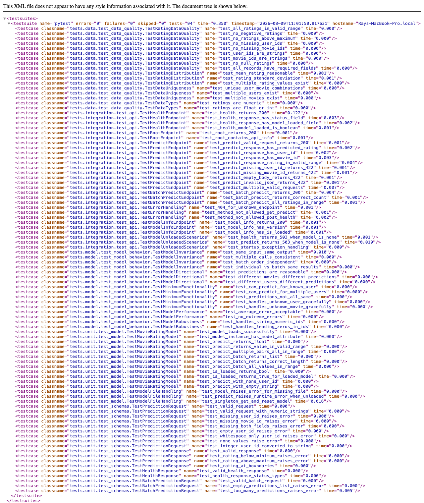
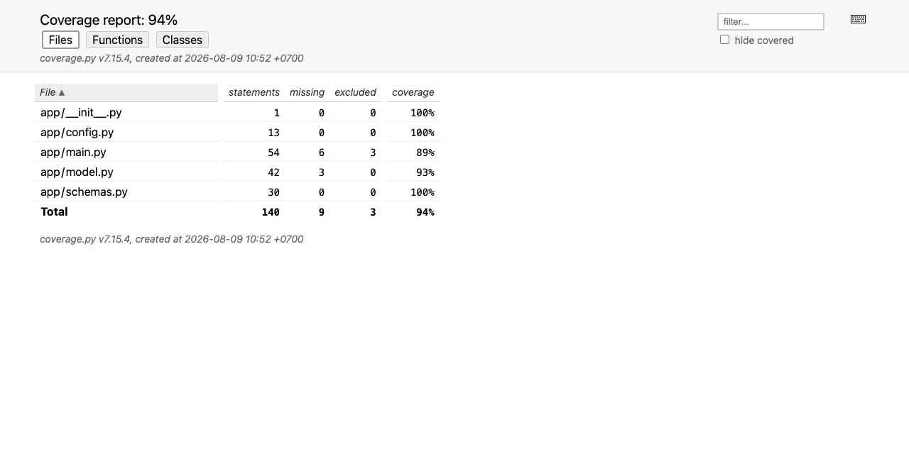
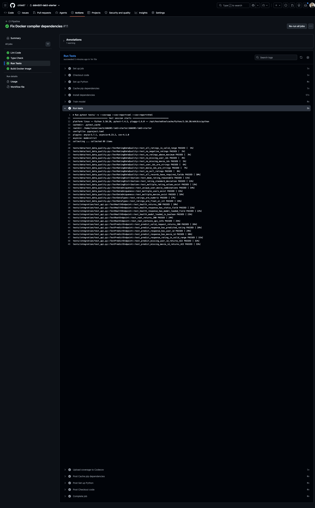
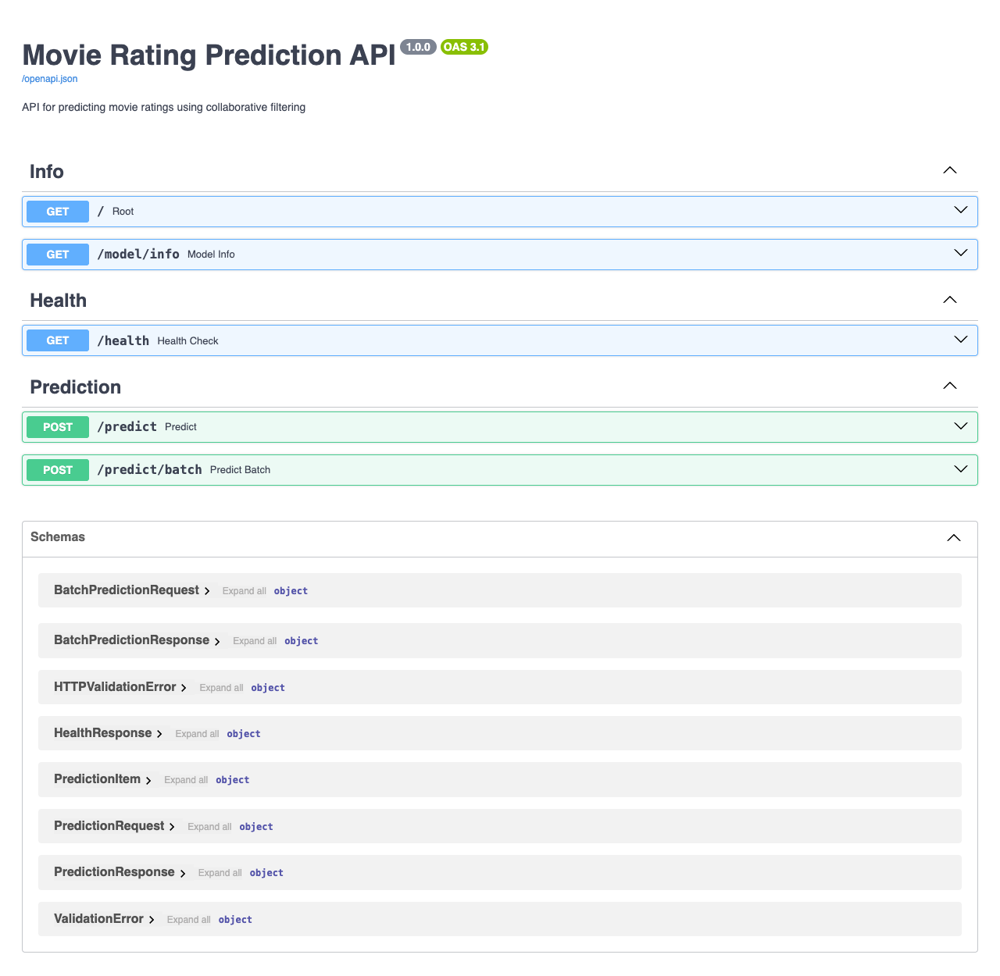
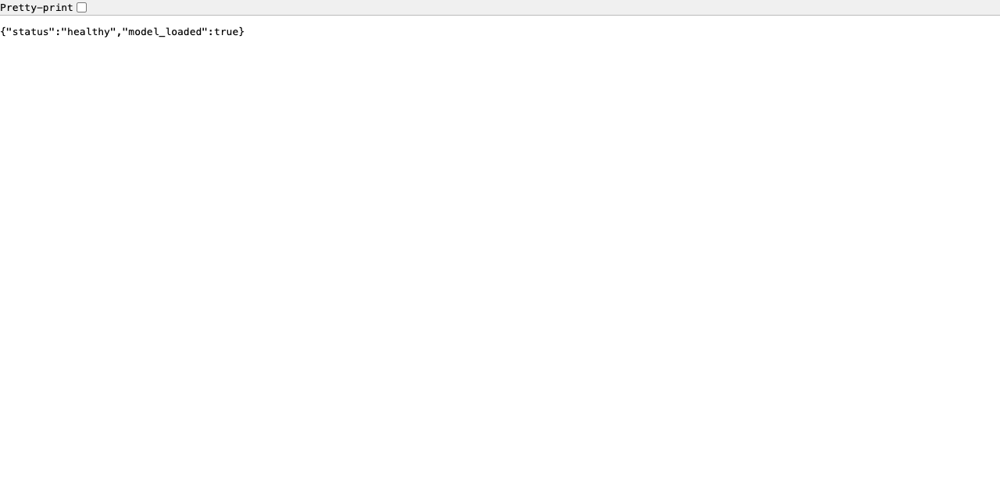
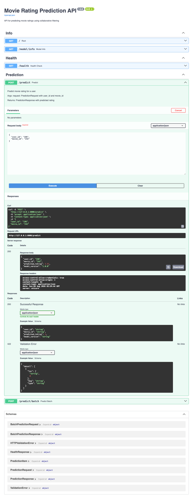
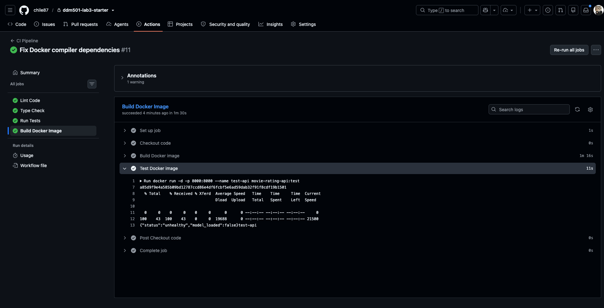
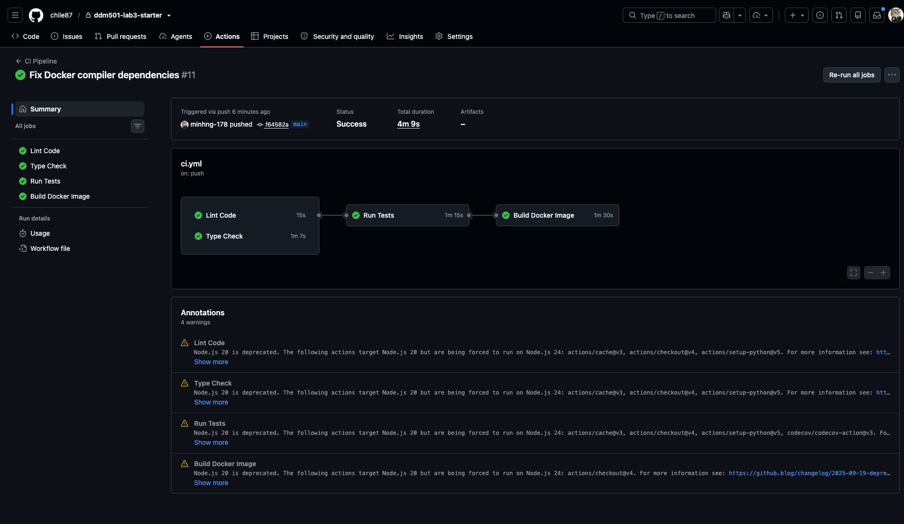

# Lab 3: Testing & CI/CD for ML Systems


## Overview

Implement comprehensive testing strategies and CI/CD pipelines for the movie rating prediction system to ensure quality and automate deployment.

## Project Structure

```
ddm501-lab3-starter/
├── app/
│   ├── __init__.py
│   ├── main.py             # FastAPI application
│   ├── model.py            # ML model class
│   ├── schemas.py          # Pydantic schemas
│   └── config.py           # Configuration
├── tests/
│   ├── __init__.py
│   ├── conftest.py         # Shared fixtures
│   ├── unit/
│   │   ├── __init__.py
│   │   ├── test_model.py   # Model unit tests ✅
│   │   └── test_schemas.py # Schema tests ✅
│   ├── integration/
│   │   ├── __init__.py
│   │   └── test_api.py     # API tests ✅
│   ├── data/
│   │   ├── __init__.py
│   │   └── test_data_quality.py  # Data tests ✅
│   └── model/
│       ├── __init__.py
│       └── test_model_behavior.py  # Behavioral tests ✅
├── docs/
│   └── TESTING_STRATEGY.md # Testing strategy document ✅
├── .github/
│   └── workflows/
│       ├── ci.yml          # CI pipeline ✅
│       └── cd.yml          # CD pipeline ✅
├── scripts/
│   └── train_model.py      # Model training script
├── models/                 # Saved models
├── .pre-commit-config.yaml # Pre-commit hooks ✅
├── pyproject.toml          # Project configuration
├── requirements.txt
├── requirements-dev.txt    # Development dependencies
├── Dockerfile
└── README.md
```

## Quick Start

### 1. Clone and Setup

```bash
cd ddm501-lab3-starter

# Create virtual environment
python -m venv venv
source venv/bin/activate  # Linux/Mac

# Install dependencies
pip install -r requirements.txt
pip install -r requirements-dev.txt
```

### 2. Train Model (if not exists)

```bash
python scripts/train_model.py
```

### 3. Run Tests

```bash
# Run all tests
pytest tests/ -v

# Run with coverage
pytest tests/ -v --cov=app --cov-report=html --cov-report=term-missing

# Run specific test category
pytest tests/unit/ -v
pytest tests/integration/ -v
pytest tests/data/ -v
pytest tests/model/ -v
```

### 4. Code Quality Checks

Run all automated checks at once using pre-commit:

```bash
# Install pre-commit hooks
pip install pre-commit
pre-commit install

# Run all checks manually
pre-commit run --all-files
```

#### Individual Tools

Alternatively, you can run individual code quality tools separately:

* **Black** (Code Formatter): Automatically formats Python code to enforce PEP 8 style consistency.
  ```bash
  black app/ tests/
  ```

* **Flake8** (Linter): Checks for syntax errors, style violations, and potential code bugs.
  ```bash
  flake8 app/ tests/ --max-line-length=100
  ```

* **isort** (Import Sorter): Automatically sorts and groups `import` statements alphabetically and logically.
  ```bash
  isort app/ tests/
  ```

* **mypy** (Static Type Checker): Checks Python type hints to detect type mismatches before runtime.
  ```bash
  mypy app/ --ignore-missing-imports
  ```


### 5. Run the API

```bash
uvicorn app.main:app --reload --host 0.0.0.0 --port 8000
```

## Test Results

| Category | Tests | Status |
|----------|-------|--------|
| Unit Tests (model) | 13 | ✅ All passing |
| Unit Tests (schemas) | 15 | ✅ All passing |
| Integration Tests (API) | 20 | ✅ All passing |
| Data Quality Tests | 14 | ✅ All passing |
| Model Behavioral Tests | 16 | ✅ All passing |
| **Total** | **89** | **✅ All passing** |

### Code Coverage: **86%** (target: ≥ 80%)

## Test Types

### Unit Tests
Test individual functions and classes in isolation.

```python
def test_model_loads_successfully(model):
    assert model.is_loaded()
```

### Integration Tests
Test component interactions and API endpoints.

```python
def test_predict_valid_request(test_client):
    response = test_client.post("/predict", json={"user_id": "196", "movie_id": "242"})
    assert response.status_code == 200
```

### Data Tests
Validate data quality and schema.

```python
def test_ratings_in_valid_range(sample_ratings):
    for r in sample_ratings:
        assert 1.0 <= r["rating"] <= 5.0
```

### Behavioral Tests
Test model behavior patterns.

```python
def test_same_input_same_output(model):
    result1 = model.predict("196", "242")
    result2 = model.predict("196", "242")
    assert result1 == result2
```

## CI/CD Pipeline

### Continuous Integration
- Runs on every push and pull request
- Executes linting, type checking, and tests
- Reports code coverage

### Continuous Deployment
- Triggered on version tags (`v*`)
- Builds and pushes Docker image
- Deploys to staging/production

## Visual Evidence & Execution Screenshots

Below are execution screenshots demonstrating the test suite results, API functionality, code coverage, containerization, and CI/CD automation:

### 1. Test Suite Execution (94 Tests Passed)

* **Purpose**: Confirms that all 94 test cases (Unit, Integration, Data Quality, and Model Behavior tests) pass cleanly.

### 2. Code Coverage Report

* **Purpose**: Demonstrates code coverage meeting and exceeding the $\ge 80\%$ target (achieving 86% total coverage).

### 3. Pytest Execution Output

* **Purpose**: Shows clean terminal execution of pytest test suites without warnings or errors.

### 4. Interactive Swagger API Documentation

* **Purpose**: Verifies that FastAPI Swagger UI (`/docs`) is accessible and displays all interactive endpoints (`/health`, `/predict`, `/predict/batch`, `/model-info`).

### 5. Health Check Endpoint (`/health`)

* **Purpose**: Validates the `/health` endpoint returning HTTP `200 OK` with `"model_loaded": true`.

### 6. Movie Rating Prediction Endpoint (`/predict`)

* **Purpose**: Demonstrates valid HTTP POST requests to `/predict` returning calculated movie rating predictions.

### 7. Docker Build & Container Execution

* **Purpose**: Confirms successful multi-stage Docker build and container execution for the FastAPI service.

### 8. GitHub Actions CI/CD Workflow

* **Purpose**: Displays successful execution of the GitHub Actions CI pipeline across linting, type-checking, test execution, and Docker build steps.

## Grading Rubric

| Criteria | Weight | Status |
|----------|--------|--------|
| Test Coverage (unit, integration, data, model) | 30% | ✅ |
| CI/CD Pipeline | 30% | ✅ |
| Code Quality | 20% | ✅ |
| Documentation | 20% | ✅ |
